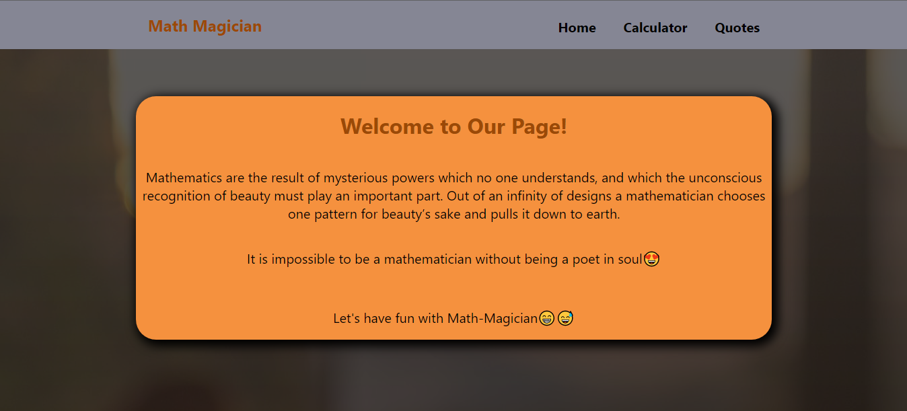

# Math-Magicians

> Math magicians is a website for all fans of mathematics. It is a Single Page App (SPA) that allows users to make simple calculations and read a random math-related quote.

### App Screenshot 
 

## Built With

- Major languages: JAVASCRIPT | HTML | CSS 
- Major Library: ReactJS
- Technologies used : Git | Github | Linter | Jest

## Live Demo

[Live link](https://math-magic.netlify.app/)

# Getting Started

This project was bootstrapped with [Create React App](https://github.com/facebook/create-react-app).
To have the local version of this project in your local PC, first clone the project with: `git clone` https://github.com/RolandM99/math-magicians.git,
then run the command `npm install` to update all packages locally.

Others commands:

### `npm start`

Runs the app in the development mode.\
Open [http://localhost:3000](http://localhost:3000) to view it in the browser.

The page will reload if you make edits.\
You will also see any lint errors in the console.

### `npm test`

Launches the test runner in the interactive watch mode.\
See the section about [running tests](https://facebook.github.io/create-react-app/docs/running-tests) for more information.

### `npm run build`

Builds the app for production to the `build` folder.\
It correctly bundles React in production mode and optimizes the build for the best performance.

The build is minified and the filenames include the hashes.\
Your app is ready to be deployed!

See the section about [deployment](https://facebook.github.io/create-react-app/docs/deployment) for more information.

👤 **Authour:** **Roland Manful Mweze**

- GitHub: [Rolandm99](https://github.com/RolandM99)
- Twitter: [@Manfulmwez](https://twitter.com/ManfulMwez)
- LinkedIn: [Roland N. MWEZE](https://www.linkedin.com/in/roland-n-mweze-8b1045189/)

## 🤝 Contributing

Contributions, issues, and feature requests are welcome!

Feel free to check the [issues page](../../issues/).

## Show your support

Give a ⭐️ if you like this project!